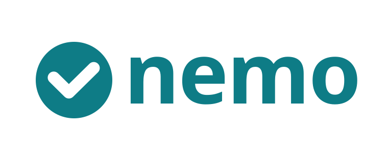

[](https://github.com/13/nemo_todo/actions/workflows/ci.yml)

A local-first todo app for Android and the web, with a small sync server you
host yourself.

- Works completely offline from the first launch. An account is optional.
- Lists with colours and icons, due dates with reminders, subtasks, notes,
  tags and four priorities, plus Today, Upcoming and search views.
- Connect it to your server later and everything already on the device is
  uploaded. Signing out keeps your tasks.
- Lists can be shared with other accounts on the same server.
- The web app is the same app: identical screens, with a navigation rail
  instead of a bottom bar on wide windows.

## Layout

| Path | What it is |
|---|---|
| `app/` | The Flutter app for Android and the web |
| `server/` | The Dart server: sync API, accounts, sharing, and hosting of the web app |
| `packages/nemo_core/` | Models, sync protocol and merge rules shared by both |
| `docs/superpowers/` | Design spec and implementation plans |
| `assets/logo/` | The mark, the wordmark and the icon sources |

## How syncing works

Every row carries a hybrid logical clock stamp. A device writes to its own
database first and queues the row; a sync sends the queue and asks for
everything past a cursor the server hands out. When two devices change the
same row, the higher stamp wins, which is what "the last edit wins" means
when clocks disagree slightly. Deletions are tombstones, so they travel like
any other change. The server keeps one change-log row per record, so the log
never outgrows the data. While the app is open it holds a lightweight
server-sent-events stream: the server only says "something changed" and the
app runs a normal sync.

`docs/superpowers/specs/2026-09-07-nemo-design.md` has the details.

## Development

Flutter 3.47.2 / Dart 3.13. This is a pub workspace, so dependencies are
resolved once at the root.

```bash
export PATH="$HOME/flutter/bin:$PATH"
flutter pub get
tool/fetch_web_assets.sh                     # sqlite3.wasm + drift worker

(cd packages/nemo_core && dart test)
(cd server && dart test)
(cd app && flutter test --coverage && dart run ../tool/check_coverage.dart 80)

(cd app && flutter run -d chrome)            # the app against a dev server
```

### Changing the database schema

`drift_schemas/` holds one JSON snapshot per schema version, and it is the
record a migration is written against. After changing a table, bump
`schemaVersion`, extend the `MigrationStrategy`, and dump the new version:

```bash
(cd server && dart run drift_dev schema dump lib/src/db/server_database.dart drift_schemas/)
(cd app    && dart run drift_dev schema dump lib/core/db/app_database.dart   drift_schemas/)
```

CI re-runs both and fails if the snapshots are not current, and a test fails
if a version has no snapshot at all. Indexes need `m.create(...)` in
`onUpgrade` rather than `m.createAll()`: drift emits index DDL without
`IF NOT EXISTS`, so `createAll` throws on a database that already has them.

To look at the design without a device, render every screen to
`app/build/screens/*.png`:

```bash
(cd app && flutter test test/design --update-goldens)
```

Those images are build output rather than stored golden assertions, so the
normal test run skips them (`--exclude-tags design`).

## The logo

The mark is a lowercase **n** whose right leg flicks up into a check: the
app's initial and what the app is for, in one stroke. `assets/logo` holds the
sources; every launcher and web icon is rendered from them, so the mark is
edited in one place:

```bash
tool/generate_icons.sh    # needs rsvg-convert (librsvg)
tool/check_icons.sh       # fails if one is missing or still Flutter's own
```

In the app the mark is painted rather than loaded, so it stays sharp at any
size and takes its colour from the theme (`NemoMark`, `NemoLogoTile`). Its
geometry mirrors `assets/logo/nemo-mark.svg`; change the two together.

The mark also serves as the Android launcher icon (adaptive, with a
monochrome layer for themed launchers), the splash screen on every Android
version, the status bar icon reminders post with, the favicon and the
installed web app's icon. The notification icon is a separate white
silhouette: Android draws small icons from their alpha channel, so the
coloured tile would arrive as a filled square.

Code generation (drift, freezed, riverpod) runs per package with
`dart run build_runner build`; generated files are committed and CI fails if
they are stale.

The server is compiled with `dart build cli`, not `dart compile exe`: the
sqlite3 package ships a build hook, and only `dart build` runs hooks and
places the native library next to the executable.

To run the app against a server on your machine, start the server with
`NEMO_CORS_ORIGINS` naming the dev origin, then enter its address on the
Connect screen in Settings.

## Running the server

```bash
cp .env.example .env
docker compose up --build -d
```

The container serves the API and the web app on port 8080 and keeps its
SQLite database in the `nemo_data` volume, which survives a restart. It
runs as a non-root user and reports its own health, so `docker compose ps`
shows `healthy` once it is serving.

The first account you create is also the last one the server accepts while
`NEMO_ALLOW_SIGNUP` is empty, so sign up before pointing the address at the
open internet. Put your own TLS reverse proxy in
front of it; nothing in the container terminates TLS.

| Variable | Meaning |
|---|---|
| `NEMO_PORT` | Listen port, default 8080 |
| `NEMO_DB` | Database file, default `/data/nemo.db` |
| `NEMO_ALLOW_SIGNUP` | `true`, `false`, or empty for "open until the first account exists" |
| `NEMO_WEB_DIR` | Where the built web app lives, default `/app/web` |
| `NEMO_CORS_ORIGINS` | Comma-separated origins allowed to call the API, for development |
| `NEMO_TRUSTED_PROXY_HOPS` | How many proxies of yours sit in front, default 0 |

If you put a TLS proxy in front of the server, set `NEMO_TRUSTED_PROXY_HOPS`
to the number of proxies it passes through. The per-address limit on the
sign-in endpoints reads `x-forwarded-for` only that many entries deep, and
at the default of 0 it ignores the header altogether: anyone can send it, so
trusting it unconditionally would limit headers rather than callers.

Forgotten password:

```bash
docker compose exec nemo nemo_server reset-password <username>
```

## Security notes

- Sessions are opaque random tokens; only their hashes are stored, they
  expire after 30 days, and an active session renews itself.
- Passwords are hashed with bcrypt. Sign-up is rate limited per address.
- On Android the session token lives in the platform keystore. On the web
  there is no such vault: it ends up in browser storage, readable by any
  script that manages to run on the page. The served app sets a strict
  content security policy, but treat a shared or untrusted browser
  accordingly.
- A device whose clock is more than an hour ahead of the server is refused
  rather than allowed to win every conflict for ever.

## Android

`minSdk` is 26. Reminders use inexact alarms, so Android may shift them by a
few minutes to save battery; they survive a reboot. The web build has no
reminders.

```bash
(cd app && flutter build apk --release --split-per-abi)
```

Alongside the files Flutter names for its own tooling, the build writes
`app/build/app/outputs/release/nemo-<version>-<abi>.apk`, so a file that
leaves the machine says which app and which version it is. That folder
mirrors the last build rather than collecting older ones.

Release builds are signed with the debug key unless `app/android/key.properties`
names a keystore (`storeFile`, `storePassword`, `keyAlias`, `keyPassword`).
CI writes that file from repository secrets. A published build must never
carry the debug key: it ships with every Android SDK, so anyone could
replace the app in place.
